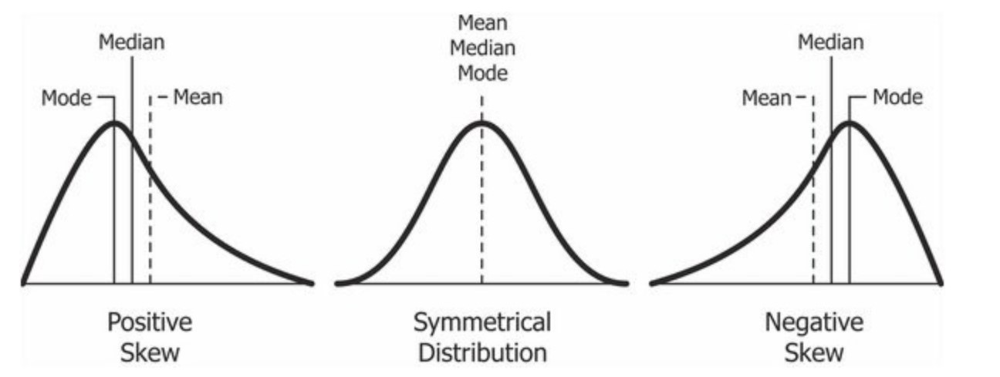
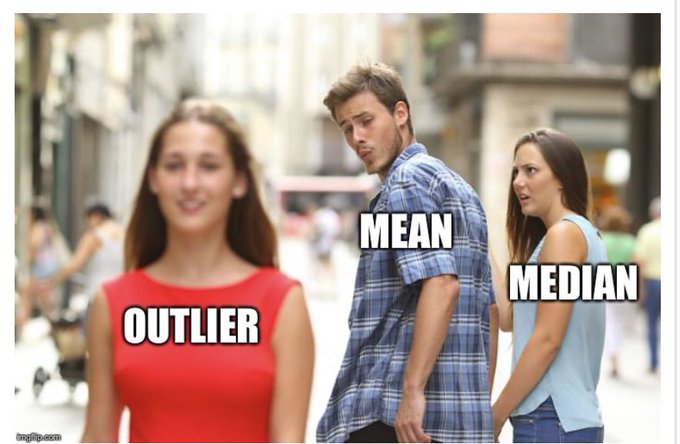

```{r setup, include=FALSE}
options(htmltools.dir.version = FALSE)
knitr::opts_chunk$set(
  message=FALSE, warning=FALSE, eval = TRUE, echo = FALSE, 
  fig.align = 'center', dev='svglite', dpi = 300
)
```

```{r results='hide'}
library(tidyverse)
library(magrittr)
load('DCPS testing.rData')
```

class: inverse, center, middle

# WHAT IS A DATA SET?


---
# Basic data set/frame

- **ROW**: Record for each *case, or unit of observation*  
  
- **COLUMN**: Vector of a single *variable*  
  
- **ELEMENT**: A particular case's value on the variable  
&zwnj; 


&zwnj; 


```{r dframe}
df = tribble(
  ~Name, ~FavCola, ~Age, ~RatingNewCola,
  "Irma", "Coke", 25, "1. Very Good",
  "Sal", "Pepsi", 22, "3. Bad",
  "Karmen", "Mr. Pibb", 26, "2. Good",
  "Jayden", "Coke", 23, "2. Good"
)

knitr::kable(df, format = 'pipe', cap = "A sample data frame", padding = 3)
```


---
# DCPS PARCC Data

Partnership for Assessment and Readiness for College and Career Assessment 

- Assessment data for 108 DC public schools, 2017`-`2018  

- Records math and language proficiency (% at grade level)  
&zwnj; 


&zwnj; 


```{r show,}
dcps %<>%
  mutate(ProfLang = round(ProfLang,1)) %>%
  select(SchName, SchType,ProfLang)

  knitr::kable(dcps[1:5,], format = "pipe", cap = "The PARCC Data", padding = 2)
```


---
# What kind of variables are those?

- **NOMINAL VARIABLE** Qualitative indicator of membership in distinct categories or groups. Captures differences in kind (e.g. `FavCola`: "Coke", "Pepsi", "Mr. Pibb")

> `SchType`: Nominal variable identifying school as Elementary, Middle, or High School.


- **NUMERIC** A quantitative record of amount or degree. Has equal`-`unit differences. (e.g. `AgeYrs`, `GDPpc`)

> `ProfLang`: Numeric variable indicating percentage of students (0-100) reading at or above grade-level.


---
class: inverse, center, middle

# DESCRIBING YOUR DATA


---
class: center, middle

# Nominal Variables
Tabulating frequencies


---
# Frequencies

- **Raw frequency** $(n_k)$: Number of times each score/category, $k$ of the variable appears in the data.
&zwnj;  

- **Relative frequency** $(\%)$: Raw frequency divided by total number of observations in the data $(N)$
$$n_k/N * 100\%$$

- **Modal category**: The score/value appearing most frequently in the data.


---
# Presenting the analysis

### DCPS schools by level, 2017`-`2018
.pull-left[
```{r tabs}
  tab = 
    dcps %>%
    count(SchType) %>%
    transmute(
      `School Type` = SchType,
      `Freq (n)` = n,
      `(%)` = round(100 * `Freq (n)`/sum(`Freq (n)`),digits = 1)
    )

  knitr::kable(tab, format = "pipe", padding = 4, cap = "FREQUENCY TABLE")
```
]

.pull-right[
```{r type, fig.width=5, fig.asp=1}
  barplot(`(%)` ~ `School Type`, data = tab,
          col = rgb(0.8,0.1,0.1,0.6),
          main = "BAR CHART", ylab = 'Freq (%)',
          cex.axis=1.5, cex.names=1.5, cex.lab=1.5, cex.main = 2.2)
```
]

---
class: center, middle

# Summarizing numeric data
Classic summary statistics


---
# The ideal case

### For "normal" distribution, calculate:

- **Mean**, $Avg_n[Y_i]$: simple average of recorded scores on $Y$; classic measure of central tendency.
$$Avg_n[Y_i]=\frac{\sum{Y_i}}{n}$$
&zwnj;  

- **Standard Deviation**, $S(Y_i)$: measure of dispersion; captures average distance between a given case and the mean.
$$S(Y_i) = \sqrt{\frac{\sum{(Y_i-Avg_n[Y_i])^2}}{n-1}}$$


---
# Describing the Distribution


Across 108 DCPS schools, an average of `r mean(dcps$ProfLang) %>% round(digits = 1)` percent of students read at grade level. The standard deviation is `r sd(dcps$ProfLang) %>% round(digits = 1)`.  


```{r d1, fig.width = 9, fig.asp = .62}
hist(dcps$ProfLang, 
     main = "Language Proficiency, DCPS 2017", ylab = "Frequency", xlab = "Students at Grade Level (%)",
     col = 'cornflowerblue', cex.lab=1.5, cex.axis=1.5, cex.main=1.8, cex.sub=1.5)
```


---
class: center, middle

# Rank statistics

For SKEWED distributions.


---
# Median and IQR

### For skewed distribution:

- **MEDIAN**, $Q_2(Y_i)$: Midpoint of a frequency distribution; the score at the 50th percentile (second quartile).  
&zwnj;  

- **Interquartile Range**, $IQR(Y_i)$:** Measure of dispersion; equal to the difference between upper and lower quartiles. 
$$IQR(Y_i)=Q_3(Y_i)-Q_1(Y_i)$$

---
# Describing the distribution

Across 108 DCPS schools, the median result is that `r median(dcps$ProfLang) %>% round(digits = 1)` percent of students read at grade level. The IQR is `r IQR(dcps$ProfLang) %>% round(digits = 1)`.


```{r d2, fig.width = 9, fig.asp = .5}

boxplot(dcps$ProfLang, horizontal = TRUE,
     main = "Language Proficiency, DCPS 2017",
     xlab = "Students at Grade Level (%)",
     ylim = c(0,100), col="#69b3a2",
     cex.lab=1.4, cex.axis=1.4, cex.sub=1.4,cex.main=1.8)

```

---
class: inverse, center, middle

# WHAT IS SKEW?
And what to do about it.


---
# Highlight the problem


### Which captures the true center?

.pull-left[

- MEAN: `r mean(dcps$ProfLang) %>% round(1)`

  
```{r d4, fig.width = 5, fig.asp = .65}
hist(dcps$ProfLang, 
     main = "Language Proficiency, DCPS 2017",
     xlab = "Students at Grade Level (%)",
     col = 'cornflowerblue', cex.lab=1.4, cex.axis=1.4, cex.sub=1.4)
```

]

.pull-right[

- MEDIAN: `r median(dcps$ProfLang) %>% round(1)`
  
  
```{r d3, fig.width = 5, fig.asp = .65}

boxplot(dcps$ProfLang, horizontal = TRUE,
        main = "Language Proficiency, DCPS 2017",
        xlab = "Students at Grade Level (%)",
        ylim = c(0,100), col="#69b3a2",
        cex.lab=1.4, cex.axis=1.4, cex.sub=1.4)

```
]


---
# What is a skewed distribution?

- **SKEWNESS**: Measure of a distribution's asymmetry, reflected in the divergence of the mean from the median.

```{r skews, out.width = '85%'}

```

- **IMPORTANCE**: For skewed distribution, the mean is a biased measure of central tendency.


---
# Outliers and skewness

```{r skewmeme, out.width = '85%'}

```

---
# Outliers and skewness

- **Sensitive mean**
  - Full sample mean: `r mean(dcps$ProfLang) %>% round(1)`
  - Without outliers: `r dcps %>% filter(ProfLang < 81) %$% mean(ProfLang) %>% round(1)`

- **Steady median**
  - Full sample median: `r median(dcps$ProfLang) %>% round(1)`
  - Without outliers:`r dcps %>% filter(ProfLang < 81) %$% median(ProfLang) %>% round(1)`

```{r skewlook, fig.width=9, fig.asp=.4}
boxplot(dcps$ProfLang, horizontal = TRUE,
        main = "Language Proficiency, DCPS 2017",
        xlab = "Students at Grade Level (%)", 
        ylim = c(0,100), col="#69b3a2",
        cex.lab=1.4, cex.axis=1.4, cex.sub=1.4,cex.main=1.8)
abline(v = 29.74, col = 'red')
```


---
# Overview

- Nominal variables
  - Modal category and freq
  - Relative frequency table or bar chart
  
- Numeric variables (skewed)
  - Report median, IQR
  - Boxplot

- Numeric variable (normal)
  - Mean, standard deviation
  - Histogram


